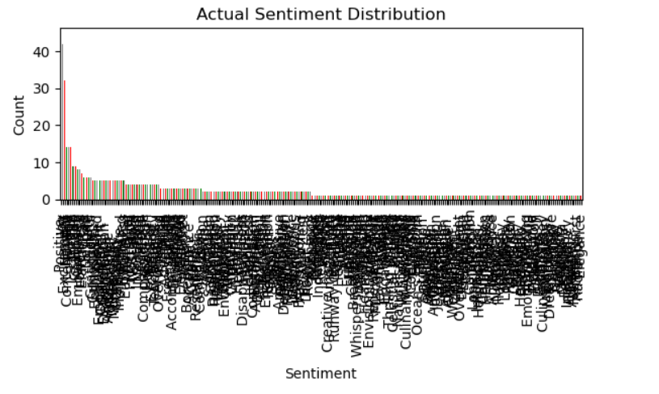
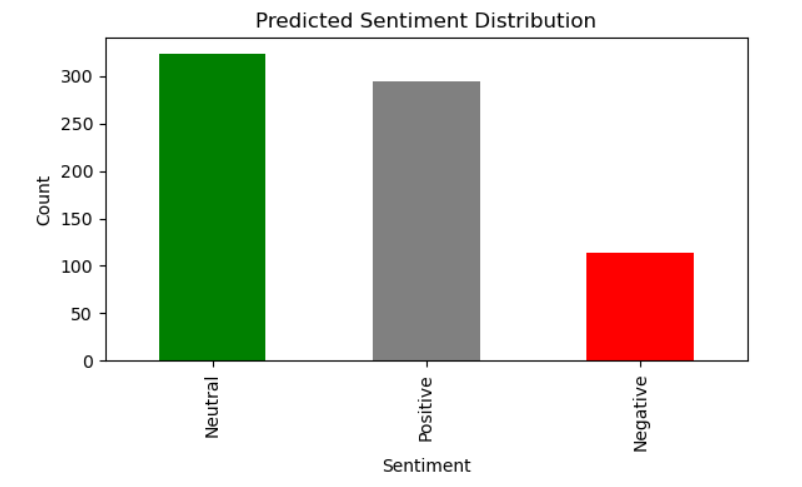
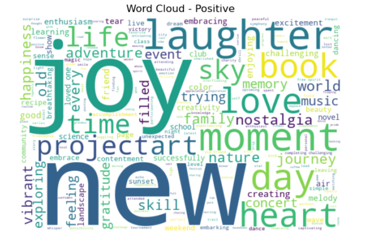
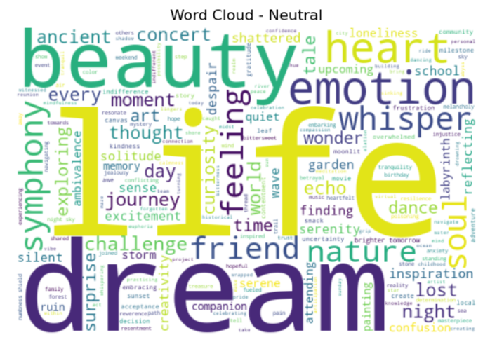
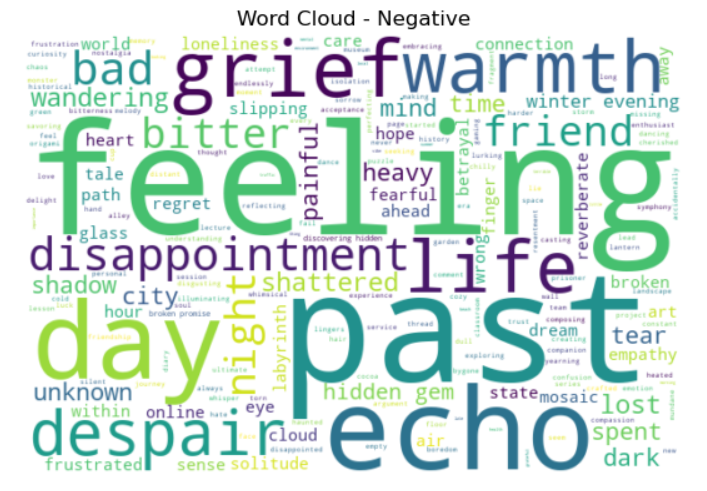

# 🧠 Sentiment Analysis with TextBlob and WordClouds

This project performs **sentiment analysis** on a labeled dataset of text using **TextBlob**, visualizes the distribution of actual vs. predicted sentiments, and generates **WordClouds** for each sentiment class.

---

## 📌 Features

- Preprocesses text using NLTK: tokenization, stopword removal, lemmatization
- Uses **TextBlob** for sentiment polarity scoring
- Visualizes sentiment distribution using **Matplotlib**
- Generates **WordClouds** for Positive, Neutral, and Negative sentiments

---

## 🗂️ Dataset

The dataset used is a CSV file named:  
`3) Sentiment dataset.csv`

It must have at least the following two columns:

- `Text`: the raw text data
- `Sentiment`: the actual sentiment label (e.g., Positive, Neutral, Negative)

> ✅ The dataset must be placed on your local machine at:
> `C:\Users\ranja\OneDrive\Desktop\3) Sentiment dataset.csv`

---
## screenshots of the outputs:







## 🧰 Requirements

Install the required libraries using:

```bash
pip install pandas nltk textblob matplotlib wordcloud
